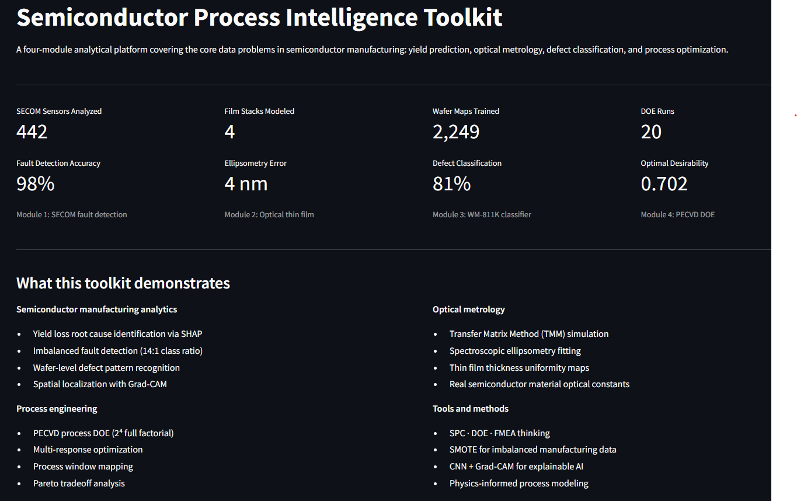
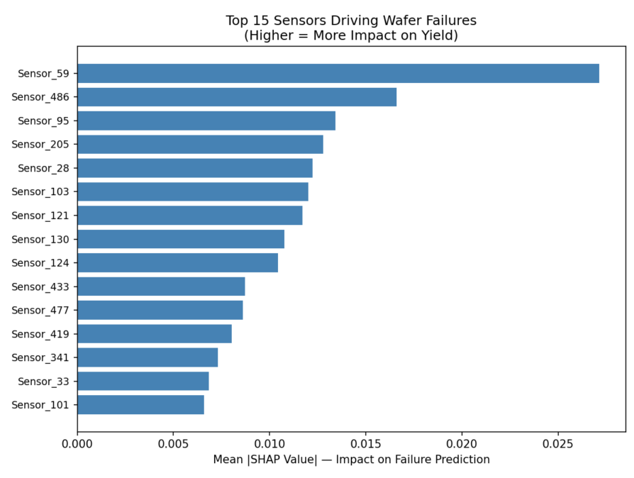
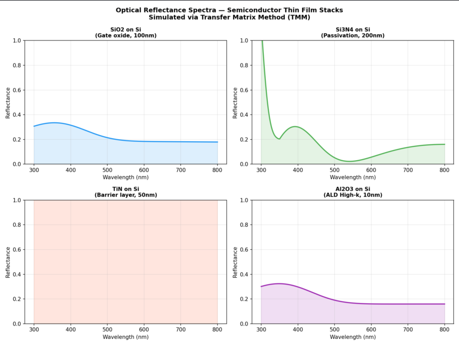
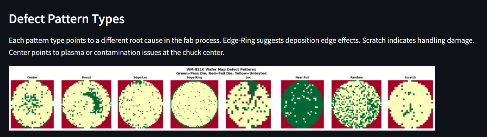
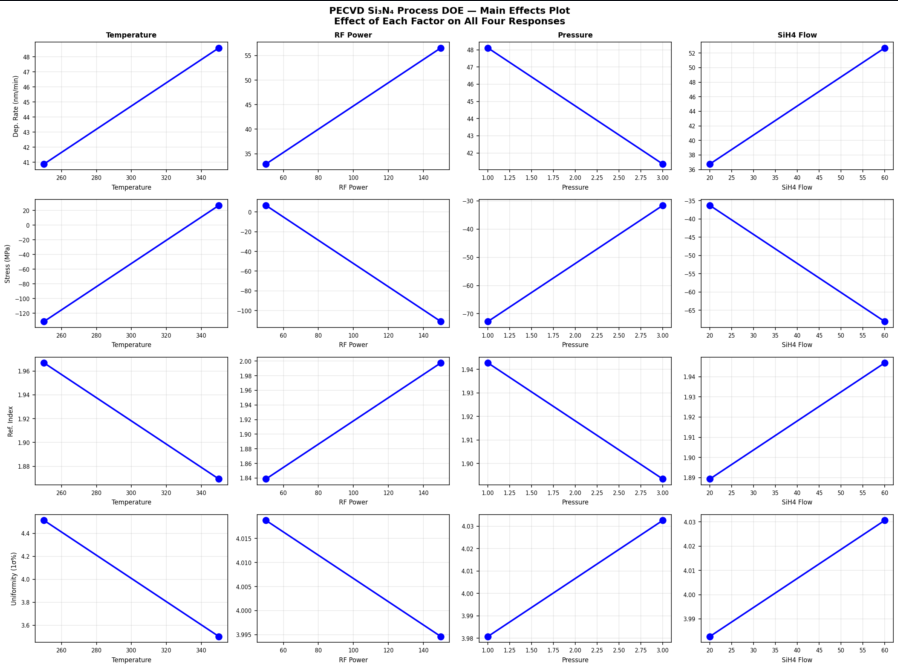

# Semiconductor Process Intelligence Toolkit

A four-module analytical platform covering core data problems in semiconductor 
manufacturing. Built to demonstrate process engineering analytical methods across 
yield prediction, optical metrology, defect classification, and process optimization.

---

## Modules

## Datasets

| Dataset | Source | Size | Description |
|---|---|---|---|
| SECOM | [UCI ML Repository](https://archive.ics.uci.edu/dataset/179/secom) | 1,567 wafers × 591 sensors | Real semiconductor fab process data |
| WM-811K | [Kaggle / MIR Lab](https://www.kaggle.com/datasets/qingyi/wm811k-wafer-map) | 811,457 wafer maps | Real wafer bin maps from TSMC production |

**Note on Module 4:** The PECVD Si₃N₄ process model is physics-informed simulation 
based on published CVD process relationships. Parameter ranges and response 
equations are derived from literature values for PECVD silicon nitride deposition 
(temperature 250-350°C, RF power 50-150W, pressure 1-3 Torr, SiH4 flow 20-60 sccm).

**Note on Module 2:** Optical constants (n, k) are based on values from the 
Palik Handbook of Optical Constants of Solids, the standard reference for 
semiconductor material optical properties.

### Module 1: Wafer Fault Detection
**Problem:** 1,567 wafers, 591 sensor readings, 14:1 pass/fail class imbalance  
**Methods:** Feature selection, SMOTE balancing, Random Forest, SHAP explainability

Key results:
- 442 informative sensors identified after variance and missing-value filtering
- 98% fault detection accuracy on balanced test set vs 93% naive baseline
- SHAP analysis identifies top 15 sensors driving yield failures
- Directly applicable to FDC/SPC workflows at wafer fabs

---

### Module 2: Optical Thin Film Metrology
**Method:** Transfer Matrix Method (TMM) for multilayer thin film simulation  
**Materials:** SiO2, Si3N4, TiN, Al2O3 on silicon substrate  
**Application:** Spectroscopic ellipsometry fitting, thickness uniformity mapping

Key results:
- Reflectance spectra simulated from 300-800nm for four semiconductor dielectrics
- Ellipsometry model fitted to within 4nm of true thickness at 142nm
- 300mm wafer uniformity map with 1σ non-uniformity quantification
- Replicates physics behind KLA, AMAT, and ASM in-line metrology tools

---

### Module 3: Wafer Map Defect Classification
**Problem:** Classify 8 defect pattern types from wafer bin maps  
**Methods:** CNN, Grad-CAM spatial explainability, balanced sampling

Key results:
- 81% accuracy across 8 defect classes on real fab data
- Near-Full pattern: 100% precision
- Grad-CAM confirms model localizes physically meaningful wafer regions
- Automates manual wafer map review performed by process engineers

Defect classes and root causes:

| Pattern | Likely Root Cause |
|---|---|
| Center | Chuck contamination or plasma non-uniformity |
| Edge-Ring | Deposition edge effects, spin coating non-uniformity |
| Scratch | Wafer handling or transport damage |
| Donut | Focus/exposure issue in lithography |
| Edge-Loc | Localized edge process excursion |
| Loc | Random localized contamination |
| Random | Particle contamination or random defects |
| Near-Full | Systemic process failure across wafer |

---

### Module 4: PECVD Si₃N₄ Process DOE & Optimization
**Process:** Plasma Enhanced CVD silicon nitride deposition  
**Design:** 2⁴ full factorial + 4 center points (20 runs total)  
**Factors:** Temperature · RF Power · Pressure · SiH4 Flow Rate  
**Responses:** Deposition rate · Film stress · Refractive index · Uniformity

Key results:
- Optimal recipe: 334°C, 126W RF, 2.2 Torr, 58 sccm SiH4
- Predicted deposition rate: 62 nm/min
- Multi-response desirability score: 0.702
- Process window map identifies viable operating region for manufacturing transfer

---

## Semiconductor Knowledge Demonstrated

| Concept | Where Applied |
|---|---|
| Statistical Process Control (SPC) | Module 1: sensor monitoring, control limits |
| Fault Detection and Classification (FDC) | Module 1: SECOM yield excursion detection |
| Imbalanced manufacturing data | Module 1: SMOTE on 14:1 class ratio |
| Optical constants (n, k) | Module 2: Palik handbook values for dielectrics |
| Transfer Matrix Method | Module 2: multilayer thin film optics |
| Spectroscopic ellipsometry | Module 2: Psi/Delta fitting for thickness |
| Thin film uniformity | Module 2: 300mm wafer spatial analysis |
| Wafer bin maps | Module 3: die-level pass/fail spatial data |
| Defect pattern recognition | Module 3: 8-class CNN classifier |
| Explainable AI for manufacturing | Module 3: Grad-CAM spatial localization |
| Design of Experiments (DOE) | Module 4: 2⁴ full factorial design |
| Multi-response optimization | Module 4: geometric mean desirability |
| CVD process physics | Module 4: temperature, RF, pressure, precursor flow |
| Process window mapping | Module 4: contour plots for manufacturing transfer |

---

## Dashboard Screenshots

### Overview

### Module 1: Fault Detection

### Module 2: Optical Metrology

### Module 3: Wafer Defect Classification

### Module 4: Process DOE
